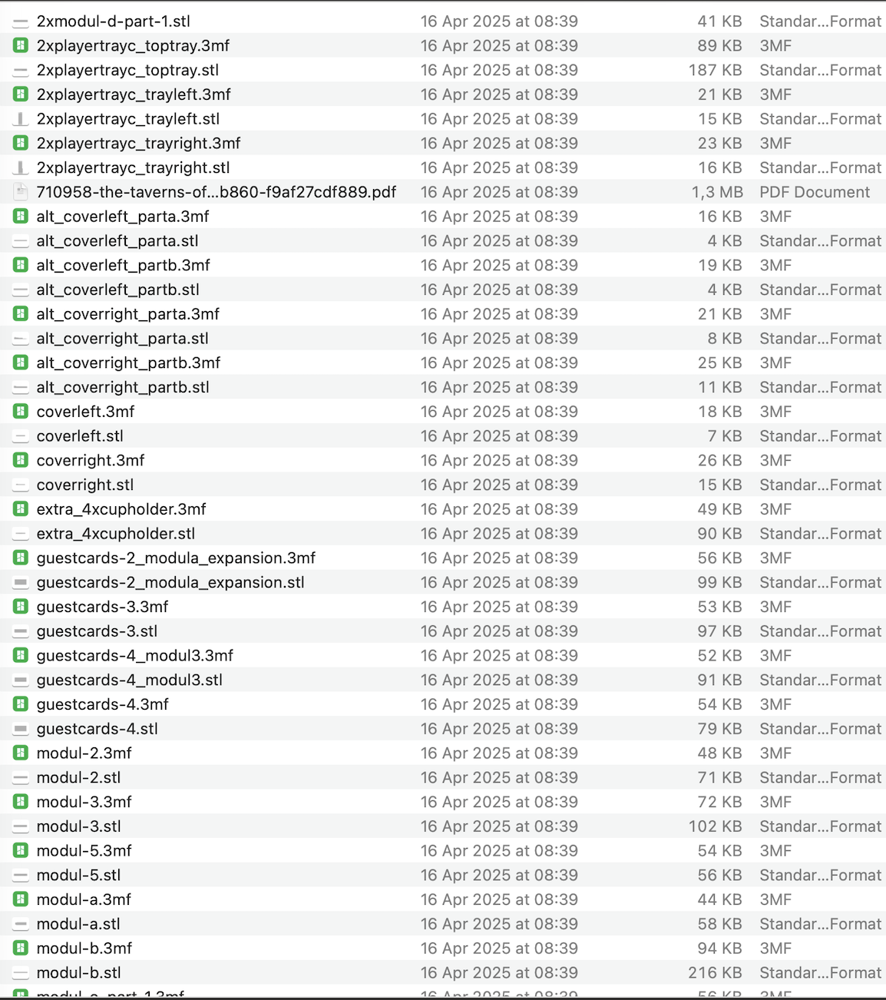
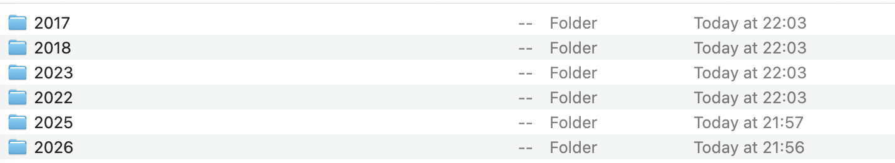

# Handy Tools

A small collection of quality-of-life scripts for your computer.

## Contents

- `mac_sorter.py` — Mac cleanup script

## mac_sorter.py

Sorts loose files and folders from your Desktop, Downloads, and Documents into a clean `Year/Month` structure. Folders get moved as a whole, so nothing inside them gets touched or reorganized.

**Setup**

Mac only. On modern macOS you'll need to grant your terminal (or VS Code) access to these folders:

`System Settings → Privacy & Security → Files and Folders`

**Usage**

By default the script runs in dry-run mode, printing what it would move without touching anything.

```bash
python3 mac_sorter.py
```

Once you're happy with the output, open the script, set `DRY_RUN = False`, and run it again to actually move things.

## Screenshots

### before

### after

